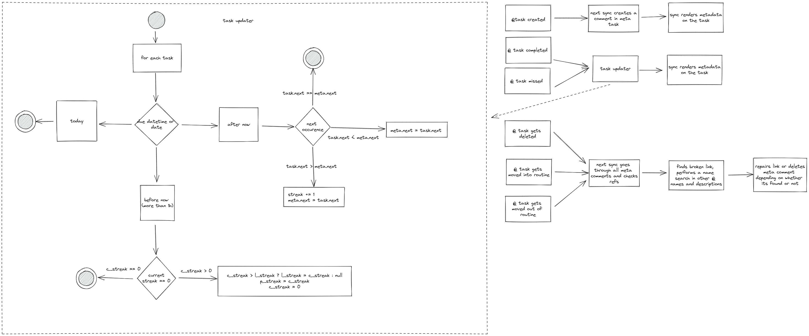

# todoist-habits

The goal of this application is to:
- track completion of daily habits in todoist
- allow you to bundle multiple habits together into a single task

## Assumptions / Ideas

- one `meta task` will be used for storing data of all habits (completions, streaks..)
- each comment on meta task will track the state of one habit
- regular `sync job` scans the state of the habit tasks (`@habit` and `@routine`) and updates `meta task`
- after `meta task` is in sync, we render the state on the comments of `@habit` and `@routine` tasks (e.g. "Your current streak for this task is 20")
- `@routine` tasks are a collection of habits executed in sequence (e.g. once i brush my teeth, i will wash my face)
- `sync job` relies on task names in order to allow transferring the habits into and out of a routine (e.g. yoga habit is now part of a routine, wash face is now an individual habit) - streaks and stats go wherever the habit goes 
- `sync job` relies on due dates for completion - whenever task is not completed and needs rescheduling, sync will break the streak, when task was completed successfully for the day, sync will update the streak)
- both `@habit` and `@routine` tasks can be completed in todoist normally 
- `@routine` tasks can also be completed through another interface (e.g. telegram or web), which would allow you to complete a routine while skipping some habits within it
- if completed through todoist, all habits within a routine are considered completed

